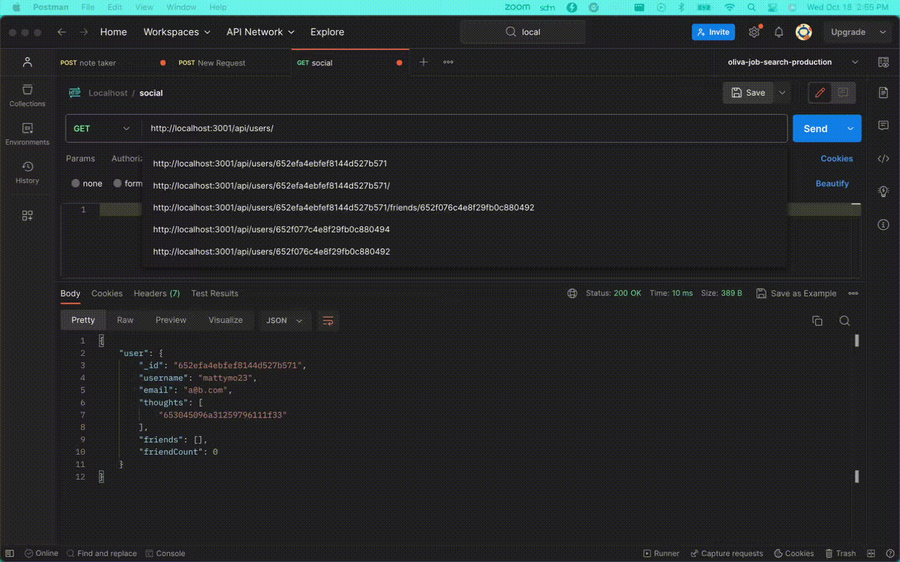

# Social Network Api

## Description

As a developer working on a social media platform, I needed a way to manage my users, as well as their Thoughts and Reactions via API.
This application serves as a way to interact with my NoSQL MongoDB to create, update, and delete resources as needed.

In building this out, my understanding of NoSQL databases was solidified, and I feel confident in building a modularized solution leveraging API routes and models using mongoose!

## Table of Contents (Optional)

- [Installation](#installation)
- [Usage](#usage)
- [Credits](#credits)
- [License](#license)

## Installation

1. Install dependencies using `npm i`
2. Start server with `nodemon`

## Usage

Once the server is started, you can create, update, and delete resources as desired.
All routes can be found in the `routes` folder.

Full App Demo: https://drive.google.com/file/d/1Jeh_oq53ZBz579HTAClih-4i7aYKZzt0/view

## Credits

### Resources:
- Mongoose: https://mongoosejs.com/
- MongoDB: https://www.mongodb.com/docs/
- Express: https://expressjs.com/en/starter/installing.html
- lean(): https://www.educative.io/answers/what-is-the-lean-method-in-mongoose
- Error resolution: https://stackoverflow.com/questions/17223517/mongoose-casterror-cast-to-objectid-failed-for-value-object-object-at-path

### Tutor:
Dominique Meeks Gombe

## License

## Badges

## Features

1. User management
   1. Create
   2. Read
   3. Update
   4. Delete
   5. Friends
      1. Add Friends to Friends List
      2. Delete Friends from Friends List
2. Thoughts
   1. Create
   2. Read
   3. Update
   4. Delete
   5. Reactions
      1. Add Reaction to Thought
      2. Delete Reaction from Thought

## How to Contribute

N/A

## Tests

N/A